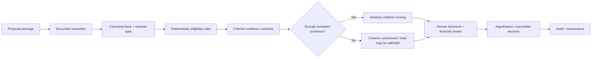

# Mulyankan evaluation system

## Decision boundary

Mulyankan performs **preliminary scrutiny and advisory scoring**. It does not issue an official funding decision. Deterministic eligibility blockers, extracted evidence, machine-learning suggestions, expert reviews, adjudications and committee decisions are stored separately so that the origin and authority of each conclusion remain visible.

## Processing sequence

The evaluation pipeline is evidence-gated: document intelligence and canonical fact reconciliation feed deterministic rules and advisory scoring, but the release gate can withhold the advisory total when evidence or policy requirements are not met. Human verification remains part of the decision path.

1. A server-created upload session binds owner, proposal version, object path, expected type and size.
2. The backend downloads the object to a bounded temporary file, checks MIME/extension/signature, scans it when malware scanning is enabled and computes SHA-256.
3. PDF, DOCX or TXT extraction creates page, section, table/image and structured-field evidence. Text-poor PDF pages use Hindi/English OCR when available.
4. A scrutiny officer can correct an extracted field. The original value remains stored, the correction is attributed and reasoned, and the version content hash changes.
5. Submission is allowed only for a confirmed active primary document with extractable text.
6. A conservative document-and-scheme gate determines whether the authoritative document can proceed to criterion evaluation. Ambiguous cases are routed to manual review rather than force-scored.
7. Deterministic rules evaluate eligibility, prohibited expenditure, duration, thrust-area fit, compliance and other hard constraints.
8. Criterion evidence contracts restrict each criterion to permitted document roles and sections. Criteria without accepted evidence remain unresolved and receive no score.
9. The registered advisory model evaluates only evidence-backed criteria, returns an uncalibrated reliability indicator, and abstains when release requirements are not satisfied.
10. Technical and financial reviewers score every active-rubric criterion. Server-side checks reject missing, duplicate, negative or excessive scores and reconcile the total.
11. Senior adjudication resolves reviewer conflicts where required.
12. The committee records the formal decision. Model and expert values at decision time are preserved for monitoring, never substituted for committee authority.

## Active model and release policy

The statistical artifact remains `moc-brochure-hybrid-ml-v2`, artifact version `2.0`, compatible with rubric `2.0`. Mulyankan 0.6.3 registers evidence-release policy `2.1`: the model is invoked only for contract-accepted evidence, evidence-empty criteria are not scored, and abstained runs have no official total.

It uses 23 criterion-specific stateless word/character hashing vectorizers and averaged logistic SGD classifiers. Training exports only numeric arrays and JSON metadata to `model.npz`; inference uses `numpy.load(..., allow_pickle=False)`. Artifact identity, code, rubric, model card and metrics are hash-verified before execution.

The model is trained on brochure-derived weak supervision unless an expert dataset is explicitly provided. Therefore:

- its reliability value is not calibrated probability;
- bootstrap holdout metrics are pipeline sanity metrics;
- it must abstain on weak, sparse or out-of-coverage text;
- a criterion without accepted evidence must remain unresolved with a null score;
- hard-screening rules remain deterministic;
- a model score cannot approve or reject a proposal;
- final authority remains human.

## Proposal and evidence integrity

- Each evaluated submission is tied to an immutable proposal-version snapshot.
- An evaluated revision must branch to a new version before editing or re-uploading.
- Only one non-superseded primary document can be authoritative for a version.
- Model runs store input/output checksums and complete rule/criterion outputs.
- Reviewer and committee records are version-bound.
- Audit rows are hash-chained and protected against update/delete on PostgreSQL.
- Controlled audit exports are HMAC-signed integrity envelopes.

## Monitoring

When an expert review is submitted, Mulyankan stores model-versus-review score delta, absolute error and recommendation disagreement. After committee decision it stores aggregate expert delta and committee disagreement. These metrics support later calibration, drift and false-approval analysis once sufficient genuine institutional data exists; they do not validate the current bootstrap model by themselves.

## Expert-grounded validation and shadow-pilot layer (0.8.0)

Version 0.8.0 adds an isolated observational validation workflow. An authorised manager freezes a scheme, exact rubric definition, registered model artifact, validation protocol and annotation rulebook into a study. Completed proposal versions are assigned to leakage-safe partitions, and at least two qualified reviewers independently score every rubric criterion while model output, peer reviews, machine-extracted fields, adjudications, committee outcomes and proposal outcome status remain hidden. The platform stores expert consensus, reviewer disagreement flags, model-versus-expert errors, selective-release behaviour and partitioned metric snapshots.

Shadow-pilot comparisons do not change proposal status, advisory scores, committee decisions or applicant-facing outcomes. Metrics remain observational and cannot establish scientific validity without an adequate external test set, approved expert protocol, adjudication, calibration, failure-mode review and institutional sign-off.

## Current limitations

The repository cannot resolve these by code alone:

- no real expert-labelled historical Coal S&T dataset has been supplied;
- no institution/time-held-out outcome evaluation exists;
- calibration, bias, subgroup and false-approval studies require genuine labels;
- production penetration testing, TLS/domain validation and multi-user acceptance require the target deployment;
- EICAR, backup restoration and disaster-recovery drills require a live controlled environment;
- institutional approval is required for rubrics, thresholds, retention and final sign-off policy.

See `docs/MULYANKAN_0.8_EXPERT_VALIDATION_SHADOW_PILOT.md`, `docs/CRITICAL_HARDENING_0.6.0.md`, `docs/BROCHURE_ML_MODEL_0.6.0.md` and `docs/ML_VALIDATION_PLAN.md`.
