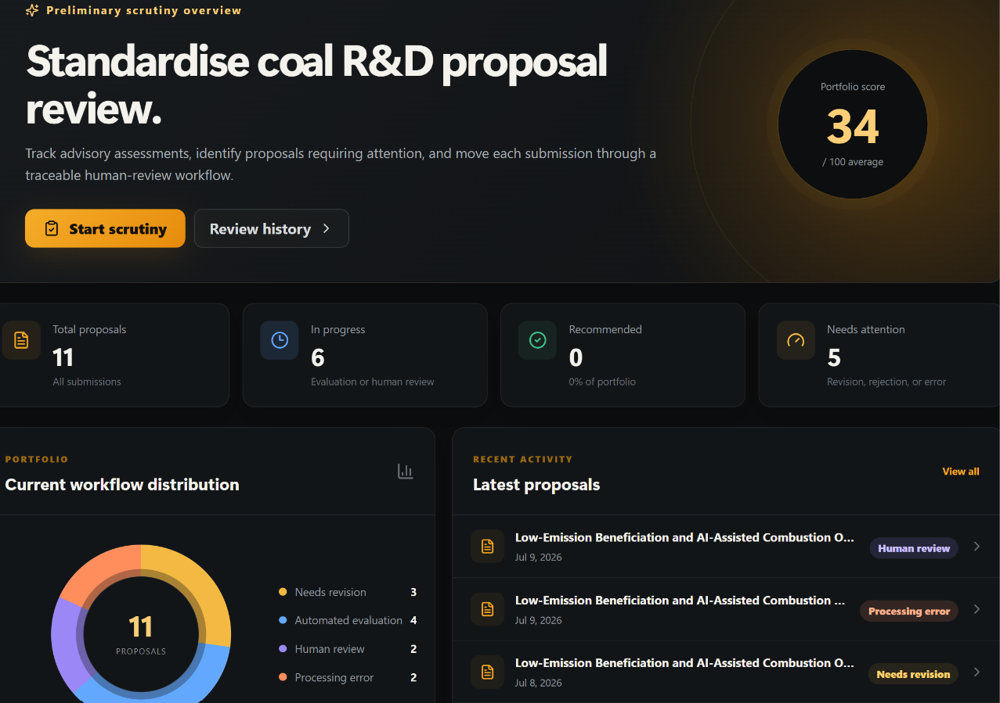
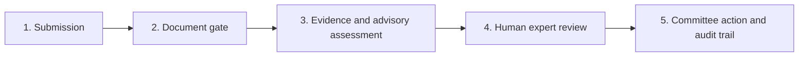
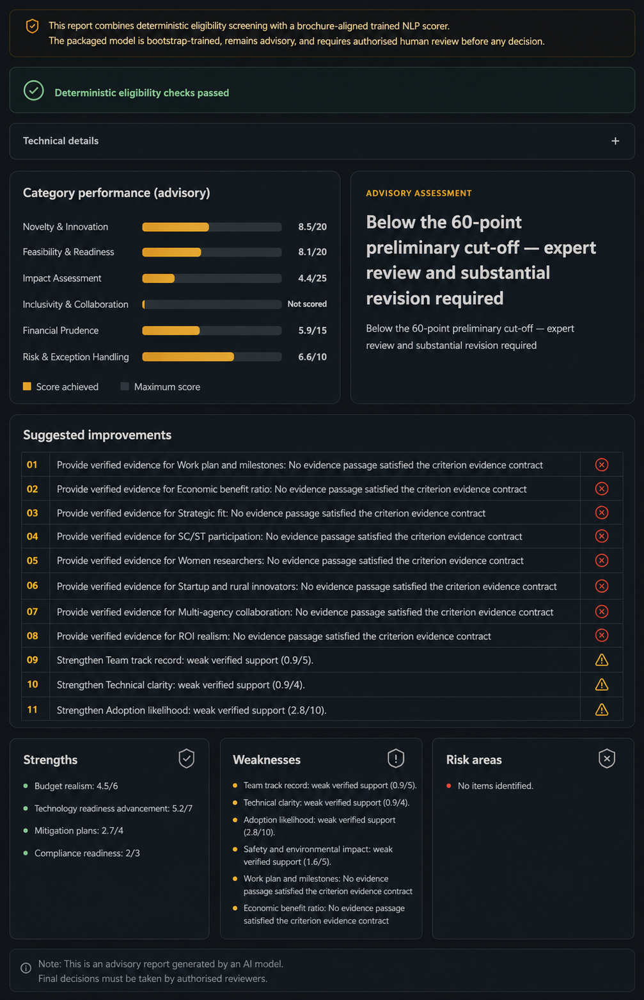
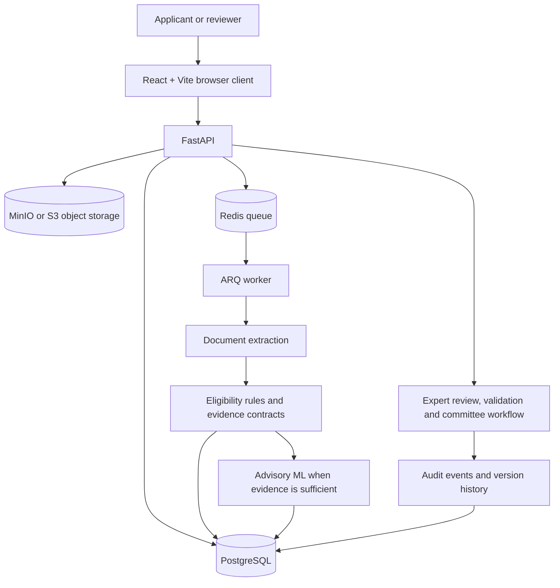

# Mulyankan

[](https://github.com/himanshu051116/Algonauts-Mulyankan/actions/workflows/quality.yml)

**AI-assisted research proposal evaluation with evidence a reviewer can actually inspect.**

<div align="center">
  <a href="https://mulyankan-seven.vercel.app/">
    
  </a>
  <br />
  <sub><em>Explore the hosted browser client, then follow the evidence trail behind each advisory assessment.</em></sub>
</div>

## Evidence, governance and delivery at a glance

| | |
|---|---|
| **Use case** | Preliminary scrutiny of Ministry of Coal Science & Technology research proposals. |
| **Evaluation** | Six categories, 23 criteria and a 100-mark governed rubric. |
| **Evidence policy** | Hard eligibility rules and evidence gates run before advisory ML. |
| **Human authority** | Reviewers, experts and committees retain the institutional decision. |
| **Traceability** | Criterion-level evidence, versioned proposals, review workflow and audit records. |
| **Live frontend demo** | [mulyankan-seven.vercel.app](https://mulyankan-seven.vercel.app/) |
| **Prototype walkthrough** | [Watch on YouTube](https://youtu.be/sQjZfEwkTu4) |
| **HackMatrix documentation** | [Project documentation (PDF)](docs/Mulyankan_HackMatrix_2026_Final.pdf) |
| **HackMatrix presentation** | [Project presentation (PPTX)](docs/Mulyankan_HackMatrix_2026_Final_Presentation.pptx) |
| **Quality checks** | [GitHub Actions workflow](https://github.com/himanshu051116/Algonauts-Mulyankan/actions/workflows/quality.yml) |

> **Decision support only.** Mulyankan is not an autonomous proposal selector. Its bundled model uses brochure-derived weak supervision, not historical institutional decisions. Read [what the model proves and does not prove](#ml-model-what-it-proves-and-what-it-does-not).

> **Public-sector safeguards.** A missing-evidence case can abstain instead of fabricating a total. All expert, conflict-handling and committee actions remain human-owned and auditable.

## Live frontend, prototype and hosted-demo status

Open Mulyankan at [mulyankan-seven.vercel.app](https://mulyankan-seven.vercel.app/).

Watch the [prototype demonstration on YouTube](https://youtu.be/sQjZfEwkTu4).

> **Hosted-demo status:** Vercel serves the public browser client. The complete sign-in, upload and evaluation flow requires separately configured API, database, storage and queue services; see [the free demo deployment guide](docs/FREE_DEMO_DEPLOYMENT.md).

### 60-second judge path



1. Watch the prototype walkthrough for the end-to-end story.
2. In a configured environment, follow a proposal from **Submission Studio** through the document gate and into its criterion-level evidence.
3. Review the abstention case, then compare the advisory output with the expert-review and Validation Lab workflows.

## Submission package

| Review item | Where to inspect it |
|---|---|
| Hosted browser client | [mulyankan-seven.vercel.app](https://mulyankan-seven.vercel.app/) |
| Prototype walkthrough | [YouTube demonstration](https://youtu.be/sQjZfEwkTu4) |
| Evaluation and evidence contract | [EVALUATION_SYSTEM.md](EVALUATION_SYSTEM.md) |
| Architecture | [docs/ARCHITECTURE.md](docs/ARCHITECTURE.md) |
| Technical report | [docs/Mulyankan_Technical_Report.docx](docs/Mulyankan_Technical_Report.docx) |
| HackMatrix 2026 project documentation | [docs/Mulyankan_HackMatrix_2026_Final.pdf](docs/Mulyankan_HackMatrix_2026_Final.pdf) |
| HackMatrix 2026 presentation | [docs/Mulyankan_HackMatrix_2026_Final_Presentation.pptx](docs/Mulyankan_HackMatrix_2026_Final_Presentation.pptx) |
| Expert validation pilot | [docs/MULYANKAN_0.8_EXPERT_VALIDATION_SHADOW_PILOT.md](docs/MULYANKAN_0.8_EXPERT_VALIDATION_SHADOW_PILOT.md) |
| Deployment configuration | [docs/FREE_DEMO_DEPLOYMENT.md](docs/FREE_DEMO_DEPLOYMENT.md) |
| Automated quality checks | [.github/workflows/quality.yml](.github/workflows/quality.yml) |

Mulyankan was built around a simple problem: a proposal score is not very useful if nobody can see **why** it was given. The system reads a proposal, checks scheme and eligibility rules, finds evidence for 23 evaluation criteria, produces an advisory score where evidence is strong enough, and keeps the final decision with human reviewers.

The project is designed around the Ministry of Coal Science & Technology proposal workflow and the practical needs of technical review: traceability, repeatability, abstention when evidence is missing, and a clear audit trail.

## What we built

A reviewer can use Mulyankan to:

- upload and version proposal documents;
- reject invalid or wrong-scheme submissions before scoring;
- extract text, tables and page-level evidence from PDF/DOCX/TXT files;
- evaluate the active six-category, **23-criterion / 100-mark** rubric;
- open the evidence behind an individual criterion instead of trusting a black-box total;
- leave unsupported criteria unresolved rather than inventing a confident score;
- run technical/financial expert review, conflict handling and adjudication;
- compare model output with blind expert reviews through the Validation Lab and Shadow Review Desk;
- retain audit records for important workflow actions.

## Demo flow

The quickest way to understand the project is to follow the same path a reviewer would use in the app:

1. **Submission Studio** — create a proposal and upload the document package.
2. **Document gate** — check file integrity, scheme compatibility and required proposal content.
3. **Evaluation** — inspect criterion-level evidence, rule results and the advisory score.
4. **Submission History** — revisit proposal versions and previous evaluation state.
5. **Expert review** — record reviewer scores, notes and recommendations.
6. **Validation Lab / Shadow Review Desk** — compare model and expert assessments without allowing the model to make the final institutional decision.

The corresponding implementation lives mainly in `src/features/proposals/`, `src/features/validation/`, `backend/app/services/evaluation_engine.py`, `backend/app/services/evidence_contracts.py`, and `backend/app/services/validation.py`.

### Reproducible sample input

[`data/fixtures/valid-proposal.md`](data/fixtures/valid-proposal.md) is a deliberately synthetic proposal used by the extraction and validation tests. It gives reviewers a small, inspectable input example without publishing private proposal data.

## See it in action

### Scrutiny dashboard

The dashboard gives reviewers a portfolio-level view of proposals, current workflow state, recent activity, and items that need attention.


### Evidence-backed advisory assessment

When enough supporting evidence is available, Mulyankan shows category-level advisory scores together with suggested improvements, strengths, weaknesses, and risk areas.



### Abstention when evidence is insufficient

The system can withhold an advisory total instead of forcing a score when the proposal does not provide enough evidence for the required criteria.


## Why the scoring is different

Mulyankan separates three things that are often mixed together in proposal-scoring demos:

- **Hard rules** answer questions such as whether a proposal is eligible to proceed.
- **Evidence contracts** decide whether the document contains enough accepted evidence to score a criterion.
- **Advisory ML** estimates a criterion score only after the evidence gate has been satisfied.

If required evidence is missing, the system can abstain. An abstained evaluation does not pretend that a normal total is available. Human reviewers can disagree with the model at every stage.

See [EVALUATION_SYSTEM.md](EVALUATION_SYSTEM.md) for the full scoring contract.

## Architecture



More detail: [docs/ARCHITECTURE.md](docs/ARCHITECTURE.md).

## Tech stack

- **Frontend:** React 18, TypeScript, Vite, Supabase authentication
- **API:** FastAPI, async SQLAlchemy, Alembic
- **Database:** PostgreSQL
- **Queue:** Redis + ARQ
- **Object storage:** MinIO / S3-compatible storage
- **Document processing:** PDF/DOCX/TXT extraction with OCR fallback
- **ML:** NumPy/scikit-learn criterion classifiers with hash-verified, pickle-free artifacts
- **Deployment:** Docker Compose locally, Vercel frontend and a free Render demo blueprint
- **Checks:** Pytest, Ruff, Mypy, ESLint, TypeScript build, release verification

## Run locally

### Prerequisites

- Docker Desktop or Docker Engine with Docker Compose
- Git
- A Supabase project for frontend sign-in (email/password auth), with its project URL and publishable/anon key

### Start the full stack

```bash
git clone https://github.com/himanshu051116/Algonauts-Mulyankan.git
cd Algonauts-Mulyankan
cp .env.example .env
```

Fill the required values in `.env`. At minimum, configure the database/storage secrets plus `VITE_SUPABASE_URL`, `VITE_SUPABASE_PUBLISHABLE_KEY`, and `SUPABASE_URL`. Then run:

```bash
docker compose up --build -d
```

The migration container applies Alembic migrations and seeds the active scheme/rubric/model registry automatically. To give the first confirmed Supabase user administrator access, run the bootstrap command with that user's Supabase UUID and email:

```bash
docker compose exec \
  -e BOOTSTRAP_ADMIN_UID=<supabase-user-uuid> \
  -e BOOTSTRAP_ADMIN_EMAIL=<administrator-email> \
  backend python -m scripts.bootstrap_admin
```

Open:

- Frontend: `http://localhost:3000`
- API: `http://localhost:8000`
- Liveness: `http://localhost:8000/health`
- Readiness: `http://localhost:8000/health/ready`

Windows-specific notes are in [docs/LOCAL_WINDOWS_RUNTIME.md](docs/LOCAL_WINDOWS_RUNTIME.md).

### Frontend development

```bash
npm ci
npm run dev
```

### Backend development

```bash
python -m venv .venv
# Windows: .venv\Scripts\activate
# Linux/macOS: source .venv/bin/activate
pip install -r backend/requirements-dev.txt
PYTHONPATH=backend pytest -q
```

In Windows PowerShell, use:

```powershell
$env:PYTHONPATH = "backend"
pytest -q
```

## Repository map

```text
.
├── backend/
│   ├── app/
│   │   ├── routers/         API endpoints
│   │   ├── services/        Evaluation, evidence, review, storage and governance
│   │   ├── ml/              Training, inference and model gates
│   │   └── models/          Database models
│   └── tests/               Regression, workflow and security tests
├── src/                     React/TypeScript application
├── data/                    Rubrics, rules, evidence contracts, model artifacts
├── migrations/              Alembic schema history
├── scripts/                 Quality, release, backup and operations scripts
├── docs/                    Architecture, validation, deployment and build notes
├── .github/workflows/       CI checks
└── docker-compose.yml       Local full-stack environment
```

For a code-oriented tour of the important files, see [docs/CODE_WALKTHROUGH.md](docs/CODE_WALKTHROUGH.md).

## ML model: what it proves and what it does not

The active policy is `moc-brochure-hybrid-ml-v2-evidence-v1`. The packaged model uses criterion-specific word/character features and logistic SGD classifiers stored as compressed NumPy arrays and loaded with `allow_pickle=False`.

The bootstrap training examples are **brochure-derived weak supervision**, not historical expert-labelled institutional decisions. The generated bootstrap JSONL is deliberately not tracked in Git; it can be recreated from the versioned weak-label specification. Bootstrap holdout metrics therefore measure recovery of generated labels, not agreement with real MoC/CMPDI decisions.

A real institutional deployment would still require expert-adjudicated proposal data, leakage-safe external evaluation, calibration, error analysis and approval through the validation workflow.

Key files:

- [data/training/moc-brochure-weak-label-spec-v1.yaml](data/training/moc-brochure-weak-label-spec-v1.yaml)
- [data/training/expert-labelled-record.schema.json](data/training/expert-labelled-record.schema.json)
- [data/models/moc-brochure-hybrid-ml-v2/model_card.json](data/models/moc-brochure-hybrid-ml-v2/model_card.json)
- [docs/MULYANKAN_0.8_EXPERT_VALIDATION_SHADOW_PILOT.md](docs/MULYANKAN_0.8_EXPERT_VALIDATION_SHADOW_PILOT.md)

Regenerate the bootstrap data and model:

```bash
PYTHONPATH=backend python -m app.ml.training --regenerate-bootstrap
```

Train from expert-adjudicated JSONL records:

```bash
PYTHONPATH=backend python -m app.ml.training \
  --expert-dataset /secure/path/expert-labelled-proposals.jsonl
```

## Security choices that matter here

The security work is tied to the proposal-review workflow rather than added as a generic checklist:

- proposal versions are immutable once used for evaluation;
- authorization is checked around proposal, evaluation and review access;
- uploaded files are stored privately and served with short-lived signed links;
- malware scanning can fail closed;
- controlled exports use HMAC-SHA256 integrity envelopes;
- model artifacts are hash-verified and do not rely on pickle loading;
- release packaging scans for common secret patterns and excludes local/runtime files.

Never commit `.env`, service-role keys, database passwords, signing keys, deployment tokens or private proposal datasets.

## Checks

The repository includes CI and local checks for backend tests, lint/type checking, frontend buildability, Compose configuration and controlled source packaging.

```bash
python -m compileall -q backend/app backend/scripts scripts/quality
python scripts/quality/validate_docs.py
ruff check backend/app backend/scripts backend/tests migrations/versions migrations/env.py scripts/quality
mypy backend/app
PYTHONPATH=backend pytest -q
npm run lint
npm run build
python scripts/quality/validate_compose.py
```

Controlled release check:

```bash
python scripts/quality/create-release.py --output-dir release
python scripts/quality/verify-release.py --release-dir release
```

CI configuration: [.github/workflows/quality.yml](.github/workflows/quality.yml).

## Project notes

If you want to go deeper after reading the code:

- [Architecture](docs/ARCHITECTURE.md)
- [Code walkthrough](docs/CODE_WALKTHROUGH.md)
- [Evaluation contract](EVALUATION_SYSTEM.md)
- [Phased development report](docs/PHASED_DEVELOPMENT_REPORT.md)
- [Release changelog](CHANGELOG_MULYANKAN_REBUILD.md)
- [0.8.0 verification report](docs/VERIFICATION_REPORT_0.8.0.md)
- [Technical report](docs/Mulyankan_Technical_Report.docx)

## Team Algonauts

Mulyankan is the hackathon project of **Team Algonauts**. The repository contains the application code, evaluation rules, model artifacts, tests and technical notes used for the submitted build.

## Current version

**0.8.0**

The public GitHub repository was initialized from the team's working source snapshot during final submission preparation on 9 August 2026. Earlier implementation changes are documented in the migrations, changelog and phased development notes; the Git commit log is used only for activity that actually occurred after repository initialization.
