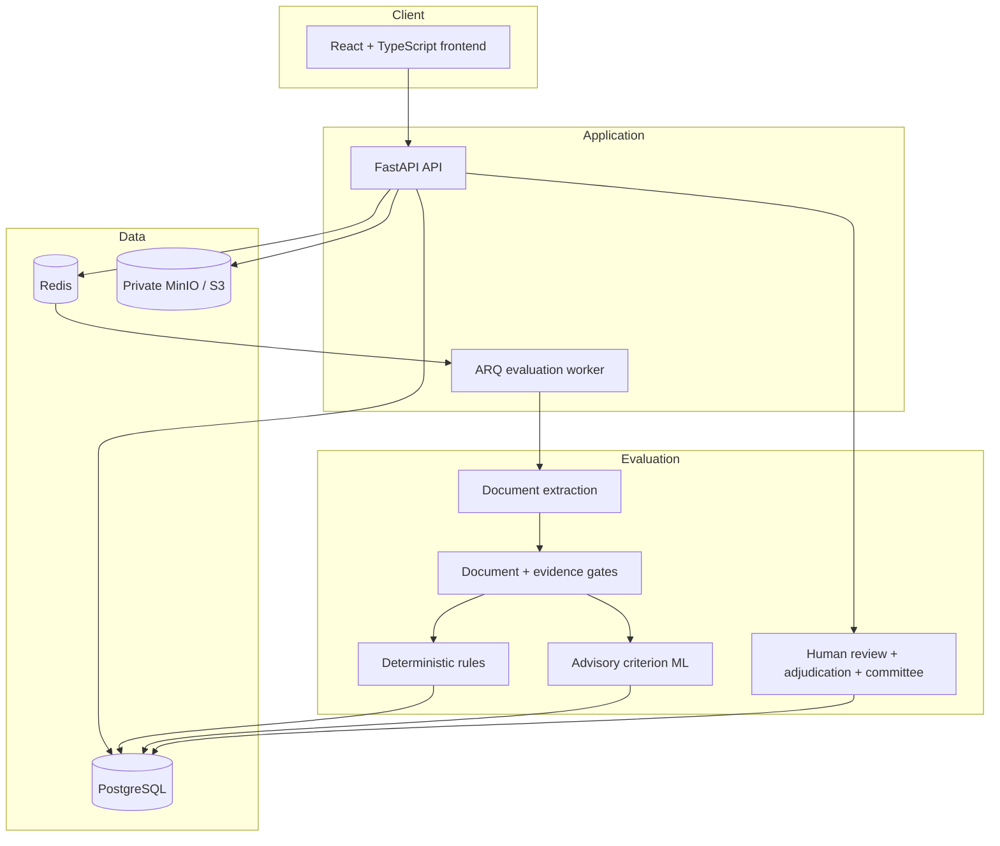
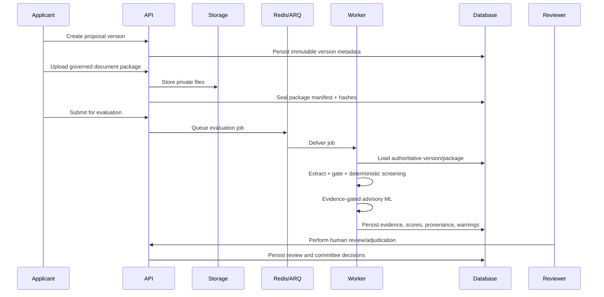

# Mulyankan architecture

This document gives reviewers a compact map of the runtime architecture, trust boundaries, and evaluation path. Detailed implementation notes remain in the versioned design documents under `docs/`.

## System overview

The Mermaid diagram below is the canonical repository architecture view. It shows the deployed application path, data services, asynchronous worker, evaluation boundary, and human-review path using text that remains diffable and reviewable in Git.

## Runtime components

## Trust boundaries

### Browser to API

The browser is untrusted. Authorization is enforced again by the backend rather than relying on frontend visibility or route guards. Supabase authentication data is validated server-side before protected proposal, document, evaluation, review, governance, and audit operations are allowed.

Primary implementation areas:

- `backend/app/auth.py`
- `backend/app/services/access.py`
- `backend/app/routers/`
- `src/api/`

### API to object storage

Uploaded proposal files remain private. The API binds uploads to server-created sessions and controlled document roles. Downloads use short-lived signed URLs rather than public buckets.

Primary implementation areas:

- `backend/app/services/storage.py`
- `backend/app/services/submission_packages.py`
- `backend/app/routers/storage.py`

### API to evaluation worker

Evaluation runs asynchronously through Redis/ARQ. The worker re-loads authoritative database state and the active model/rubric registry rather than trusting mutable client input.

Primary implementation areas:

- `backend/app/worker.py`
- `backend/app/services/evaluation_engine.py`
- `backend/app/services/model_registry.py`

## Evaluation data flow

## Evidence and scoring boundaries

The scoring path separates four concepts that are easy to conflate:

1. **Document validity** — whether the source can be processed and belongs to the expected scheme.
2. **Hard screening** — deterministic brochure-aligned conditions that are not ML predictions.
3. **Criterion evidence** — whether acceptable source evidence exists for a specific rubric criterion.
4. **Advisory score** — model/rule output released only where evidence and policy permit it.

The implementation intentionally supports `unresolved` and `abstained` states. Missing evidence is not silently converted into a low score, and an abstained run does not expose a normal official total.

Primary implementation areas:

- `backend/app/services/document_gate.py`
- `backend/app/services/evidence_contracts.py`
- `backend/app/services/rules.py`
- `backend/app/services/scoring.py`
- `backend/app/ml/inference.py`

## Persistence and auditability

PostgreSQL stores proposal versions, document/package identity, evaluation provenance, review records, governance state, validation studies, and audit events. Alembic migrations under `migrations/versions/` document schema evolution.

The audit subsystem records controlled events and supports integrity-protected exports. Integrity envelopes are not represented as legal digital signatures.

Primary implementation areas:

- `backend/app/models/`
- `backend/app/services/audit.py`
- `backend/app/services/signing.py`
- `backend/app/routers/audit.py`

## Validation workflow

Release 0.8.0 introduces a separate validation-lab workflow for blind expert annotation and observational model-versus-human comparison. It does not automatically promote a model or alter proposal decisions.

Primary implementation areas:

- `backend/app/services/validation.py`
- `backend/app/routers/validation.py`
- `src/features/validation/`
- `data/validation/`

## Operational checks

The repository contains:

- application liveness and readiness endpoints;
- worker heartbeat monitoring;
- Prometheus metrics;
- Docker Compose health checks;
- static analysis and test gates;
- controlled release creation and independent verification.

Primary implementation areas:

- `backend/app/routers/health.py`
- `scripts/quality/validate-release.sh`
- `scripts/quality/create-release.py`
- `scripts/quality/verify-release.py`
- `.github/workflows/quality.yml`
